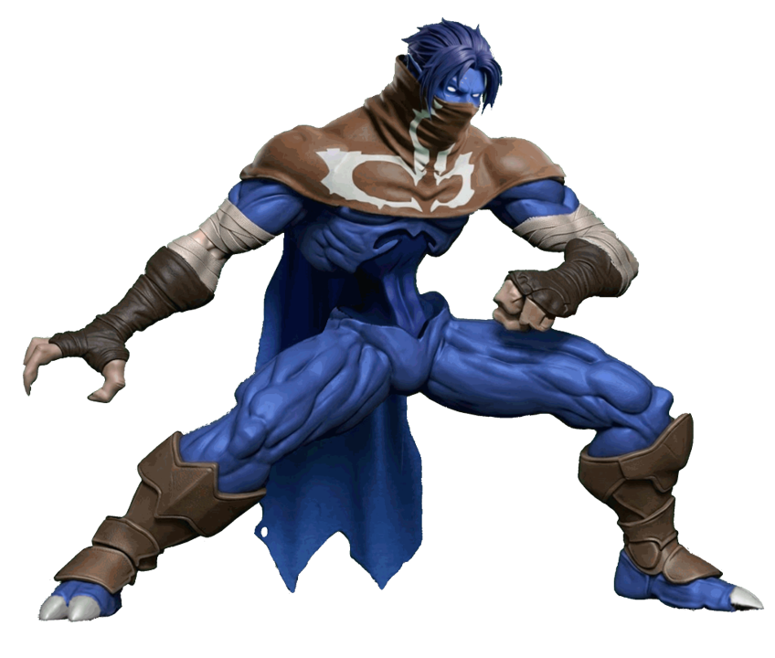

# Raziel (Legacy of Kain)



---

## Información

- **Personaje:** Raziel
- **Origen:** Legacy of Kain: Soul Reaver
- **Engine:** MUGEN 1.0
- **Autor del proyecto:** Mugen's World
- **Estado:** En desarrollo activo
- **Versión actual:** Raziel espectral con sistema de Soul Reaver física

---

## Descripción

Este proyecto busca recrear a **Raziel**, protagonista de *Legacy of Kain: Soul Reaver*, como un personaje jugable para **MUGEN 1.0**.

La versión actual está construida alrededor de dos formas principales:

- **Con Soul Reaver física:** Raziel sostiene la espada dentro de sus propios sprites.
- **Sin espada física:** Raziel entra al sistema corporal / Reaver.

El objetivo es que ambas formas evolucionen hasta convertirse en estilos de combate claramente diferenciados.

---

## Estado actual

🚧 **Proyecto en desarrollo activo**

### Ya implementado

- Stand con espada física — **Action 1000**.
- Caminata hacia adelante con espada — **Action 1010**.
- Caminata hacia atrás con espada — **Action 1015**.
- Giro con espada — **Action 8**.
- Cambio de forma con **Y + Z**.
- Animación para clavar la espada — **Action 1005 / State 2100**.
- Animación para recuperar la espada — **Action 1006 / State 2110**.
- Soul Reaver clavada como objeto independiente mediante **Helper 6500**.
- Grieta animada de aparición, estado estable y desaparición.
- Composición por capas para simular profundidad:
  - grieta detrás de los personajes;
  - espada delante de los personajes;
  - borde frontal de la grieta delante de la espada.
- Recuperación de la espada limitada por proximidad.
- La espada solo puede recuperarse cuando su Helper existe y está en el estado de espada clavada.
- Sistema global de estado de espada mediante `var(20)`.
- Selector de Reaver mediante `var(21)`.
- Cambio de Reaver con **Z** cuando Raziel está sin la espada.
- Spectral Reaver conectado visualmente como modo `var(21)=0`.
- Spectral azul para palettes 1 y 3.
- Spectral verde para palettes 2 y 4.
- Spectral visual en Stand, Walk y transiciones de Crouch.
- Moveset corporal heredado todavía disponible.
- Throws, Taunt, Run y Hop Back heredados.

### Todavía en desarrollo

- Crouch completo con espada.
- Jump completo con espada.
- Run / Dash con espada.
- Guard y GetHit específicos con espada, si fueran necesarios.
- Normales y combos propios con espada.
- Ataques aéreos y agachados con espada.
- Fire, Air, Water, Earth, Lightning, Light, Dark y Spirit Reaver jugables.
- Ataques y Specials propios de cada Reaver.
- Lanzamiento de la espada.
- Sistema de carga / absorción de energía de la espada.
- Specials y Supers definitivos.
- IA.
- Balance y FX avanzados.

---

## Controles actuales destacados

### Soul Reaver física

**Y + Z**

- Con espada equipada: Raziel la clava.
- Sin espada: Raziel la recupera solamente si está suficientemente cerca de la espada clavada.

### Cambio de Reaver

**Z**

Disponible cuando Raziel está **sin la espada física**, de pie, con control y sin mantener adelante/atrás.

El ciclo interno es:

`Spectral → Fire → Air → Water → Earth → Lightning → Light → Dark → Spirit → Spectral`

Actualmente solo **Spectral** tiene representación visual conectada. Los demás modos están reservados para desarrollo posterior.

---

## Arquitectura

El proyecto separa la lógica en tres bloques principales:

```text
CORE
├── constants.cns
├── core.cns
└── system.cns

COMBAT
├── unarmed.cns
├── sword.cns
└── weapon.cns

REAVERS
├── reavers_1.cns
├── reavers_2.cns
└── reavers_3.cns
```

Interpretación:

- **CORE:** comportamiento global de Raziel.
- **COMBAT:** combate corporal, forma con espada y espada física independiente.
- **REAVERS:** poderes específicos de cada Reaver.

Los archivos `reavers_1.cns`, `reavers_2.cns` y `reavers_3.cns` siguen reservados para la implementación completa de los nueve Reavers.

---

## Desarrollo del personaje

Los sprites están siendo creados mediante una combinación de herramientas de IA y edición manual.

### Pipeline general

1. Creación de sprites base.
2. Conversión a estilo 3D.
3. Generación de animaciones.
4. Conversión a video.
5. Extracción de frames.
6. Edición y limpieza manual.
7. Conversión a BMP.
8. Importación al SFF.
9. Creación de AIR, CLSN y lógica MUGEN.

### Herramientas utilizadas

- ChatGPT
- Grok
- Gemini
- A2E
- Vidu
- VLC
- Fighter Factory Classic
- Herramientas de edición de imagen, BMP y palettes ACT

---

## Base y referencias

El proyecto parte de la plantilla clásica de MUGEN / Elecbyte y estudia implementaciones anteriores de Raziel realizadas por otros autores.

Referencias históricas:

- **Raziel Seylos**
- **Dave Rattlz**

El personaje de Dave Rattlz se utiliza principalmente como referencia de estudio para ideas sobre Reavers, Helpers, States y organización de lógica. La arquitectura actual fue reorganizada para soportar las dos formas principales del personaje.

---

## Filosofía del proyecto

> MUGEN es de la comunidad para la comunidad.

El contenido de este proyecto se comparte libremente para:

- usar;
- estudiar;
- modificar;
- editar;
- redistribuir;
- crear versiones derivadas;
- reutilizar sprites y recursos dentro de otros proyectos.

Este proyecto es **fan-made y sin fines comerciales**.

---

## Créditos

### Proyecto actual

- Mugen's World

### Base / referencias del personaje

- Raziel Seylos
- Dave Rattlz

### Juego original

- Crystal Dynamics
- Eidos Interactive

Raziel, Legacy of Kain, Soul Reaver y sus elementos asociados pertenecen a sus respectivos propietarios.

---

## Documentación

- `1. author.txt` — autoría, filosofía, créditos y contexto del proyecto.
- `2. developer.txt` — estado técnico real, arquitectura, variables, States y sistemas implementados.
- `3. gameplay.txt` — controles y comportamiento que funcionan actualmente.
- `4. labs.txt` — ideas, alcance futuro y mecánicas todavía no implementadas.

**No asumir que una idea de `4. labs.txt` ya existe en el código.**