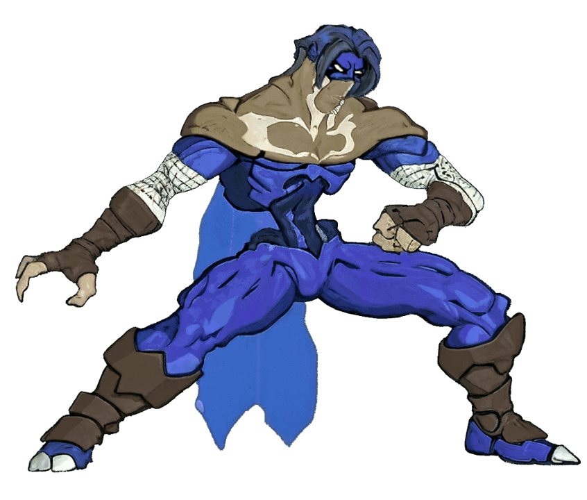

# Raziel (Legacy of Kain)

---

## Información

- **Personaje:** Raziel  
- **Origen:** Legacy of Kain: Soul Reaver  
- **Versión del personaje:** Raziel Azul (forma espectral)  
- **Autor del proyecto:** Mugen's World  
- **Estado:** En desarrollo (etapa muy temprana)

---

## Descripción

Este proyecto busca recrear a **Raziel**, protagonista de la saga *Legacy of Kain*, como un personaje jugable para **MUGEN**.

Esta versión corresponde a **Raziel en su forma espectral (Azul)**.  
En el futuro se planea desarrollar también una **versión vampiro** del personaje.

El proyecto actualmente se encuentra en una etapa **muy temprana de desarrollo**, por lo que muchas mecánicas, habilidades y animaciones aún están en proceso de creación.

---

## Desarrollo

Los sprites de este personaje están siendo **creados desde cero** utilizando diferentes herramientas de IA y procesos de edición.

Proceso general utilizado:

1. Creación de sprites base
2. Conversión a estilo 3D
3. Generación de animaciones
4. Conversión a video
5. Extracción de frames
6. Conversión final a sprites BMP para MUGEN

Herramientas utilizadas durante el proceso:

- ChatGPT
- Grok
- Gemini
- A2E
- Vidu
- Herramientas de extracción de frames

Este proceso permite generar animaciones completamente nuevas para el personaje.

---

## Base del código

Parte del código utilizado para este proyecto proviene de un personaje jugable previo en 2D que me fue proporcionado por:

- **Raziel Seylos**
- **Dave Rattlz**

Ese personaje ya era jugable, pero aún faltaban implementar varias funcionalidades y más variantes del **Soul Reaver**.

A partir de ese trabajo base se están desarrollando nuevas mecánicas, sprites y animaciones.

---

## Créditos

**Autor del proyecto**
- Mugen's World

**Base del personaje**
- Raziel Seylos  
- Dave Rattlz

Gracias por compartir el trabajo original que permitió iniciar este proyecto.

---

## Estado del proyecto

🚧 Proyecto en desarrollo temprano  

Actualmente el personaje se encuentra **en una fase muy inicial**, por lo que aún faltan:

- Movimientos
- Animaciones
- Habilidades
- IA
- Variantes del Reaver

El desarrollo irá avanzando progresivamente.

---

## Filosofía del proyecto

El espíritu de este proyecto sigue la filosofía clásica de la comunidad **MUGEN**:

> MUGEN es de la comunidad para la comunidad.

Este proyecto es completamente libre para la comunidad.

---

## Uso y distribución

Se permite libremente:

- Usar este personaje
- Modificarlo
- Editarlo
- Crear versiones derivadas
- Usar los sprites
- Integrarlo en otros proyectos

No hay restricciones de uso.

Este proyecto es **completamente libre y comunitario**.

Bajo ninguna circunstancia se cobra por este contenido.

---

## Futuro del proyecto

Planes a futuro:

- Versión **Raziel Vampiro**
- Más habilidades
- Soul Reaver adicionales
- Mejoras de animación
- Más efectos visuales
